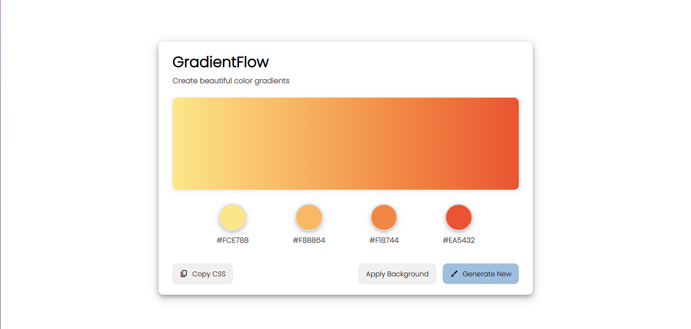
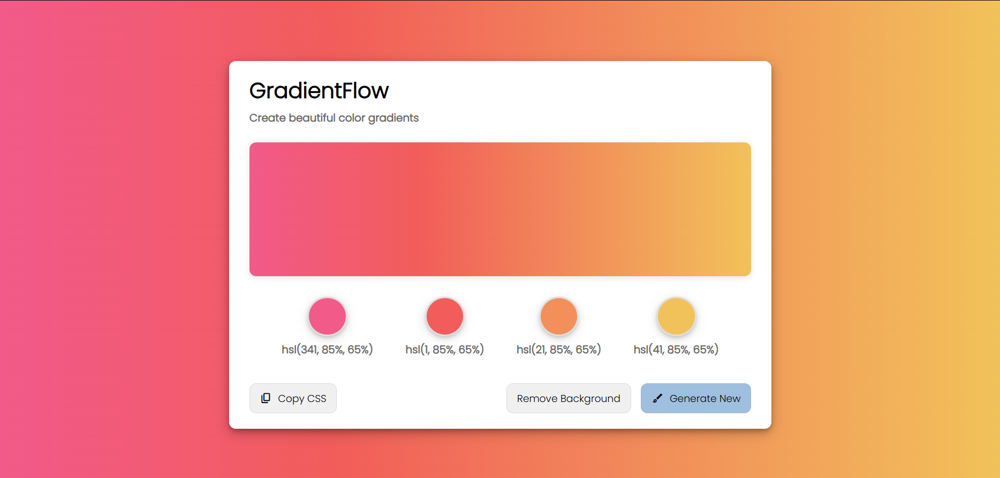
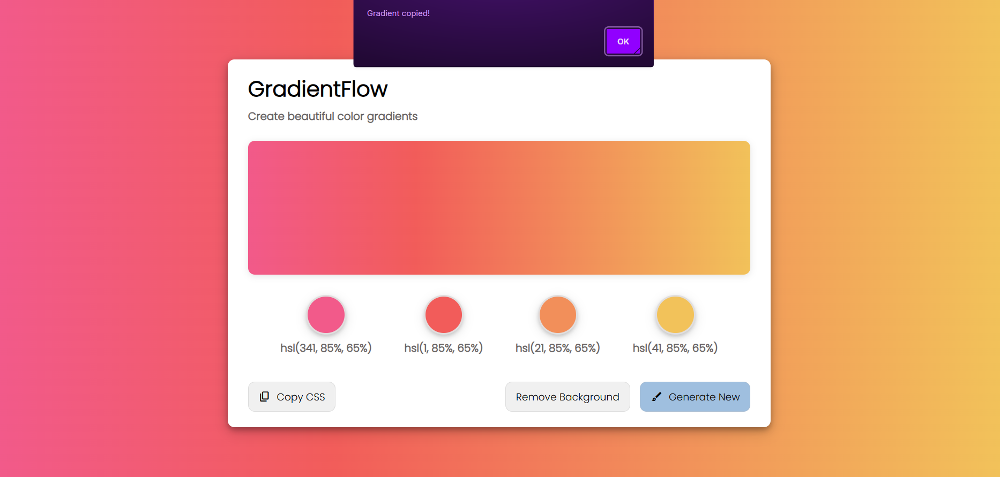

# 🧑‍🎨 GradientFlow

GradientFlow is a minimal and elegant React app that allows users to generate, preview, copy, and apply beautiful multi-color linear gradients. Built for simplicity and style, it's a great visual tool for designers and developers.

---

## ✨ Features

- 🎨 Live gradient preview
- 🧱 View individual color codes
- 🔄 Generate new random gradients
- 🖼️ Toggle background application on the body
- 📋 One-click CSS gradient copy

---

## 📸 Preview

### Default Screenshot



### Generate gradient and background applied Screenshot



### Copied gradient Screenshot



---

## 🚀 Getting Started

### 1. Clone the repo

    ```bash
      git clone https://github.com/aryandas2911/GradientFlow.git
      cd gradientflow
      npm install
      npm run dev

---

## 🧱 Built With

1. React
2. CSS Flexbox & Box Shadows
3. JSX + Dynamic Styling

---

## 🙌 Author
Aryan Das


